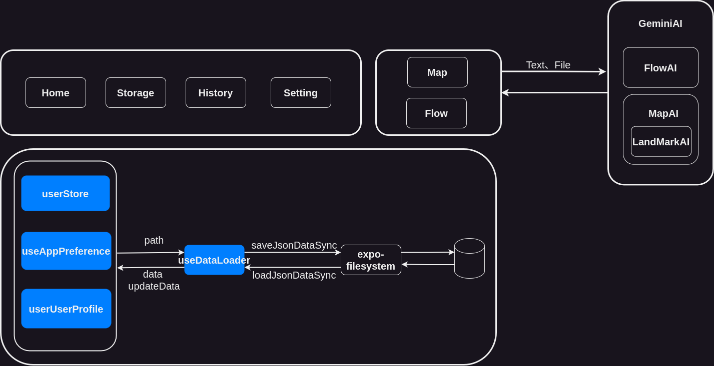

# MindLane

An App focused on memory and knowledge exploration

# Introduction

---

MindLane is an innovative mobile application that combines the ancient and efficient memory palace technique with advanced AI technology to provide users with powerful memory assistance and problem-solving process visualization. Users can use the application to easily create memory palace scenes, associate the information to be remembered with vivid images and spatial locations, thereby improving memory efficiency; at the same time, they can also use AI to generate solutions to problems and visualize their processes, making it easier for users to interact and understand them in depth.

# Features

---

- 🚧Generate an interactive picture based on the content that needs to be remembered
- 🚧Connect the memory palaces in a flowchart
- 🚧Explore knowledge in flowcharts

# Development

---

1. Install dependencies

```
1. npm install
```

2. Create .env file in root path

```
touch .env
```

2. Set your gemini api key in .env

```
EXPO_PUBLIC_GEMINI_API_KEY=<your gemini api key> 
```

3. Start the app

```
npx expo start
```

# Project Structure

---



```plaintext

MindLane
├── .gitignore  
├── app.json  
├── eas.json  
├── package.json  
├── tsconfig.json   
├── app/                # 应用主代码
│   ├── _layout.tsx     # 应用的整体布局文件
│   ├── index.tsx       # 应用的入口文件
│   ├── navigation/     # 存放导航相关的代码，管理应用的页面导航
│   └── routes/         # 存放应用的路由配置文件，定义不同页面的路由规则
├── components/         # 可复用UI组件
│   ├── ui/             # 公共基础组件
├── context/            # 全局状态管理（如Redux、Context API）
│   └── store/          # 存放状态管理相关的代码
├── features/           # 按功能模块拆分的代码
│   ├── flow/           # 可视化过程拆解功能模块
│   ├── gemini/         # 与Google Gemini模型交互的功能模块
│   └── map/            # 记忆宫殿功能模块
├── hooks/              # 自定义React Hooks
│   ├── useDataLoader.tsx # 可能用于数据加载的自定义Hook
│   ├── useDataLoder.tsx # 可能是拼写错误，推测功能与useDataLoader.tsx类似
│   └── useDialog.tsx # 处理对话框相关逻辑的自定义Hook
├── types/              # TypeScript类型定义
├── utils/              # 工具函数和辅助类
│   ├── base64Image.ts # 可能包含与Base64图片处理相关的工具函数
│   ├── fileUtils.ts # 包含文件操作的工具函数，如文件的创建、删除、保存和加载等
│   └── filesystem/     # 存放文件系统操作的具体实现
│       ├── file.ts # 提供文件的写入、删除、同步加载和保存JSON数据等功能
│       └── path.ts # 包含检查文件是否存在的函数
├── assets/             # 静态资源（图片、字体）
│   ├── fonts/          # 存放项目中使用的字体文件
│   └── images/         # 存放项目中使用的图片资源
```

# Todo

---

## [♻️](https://github.com/FourWindff/MindLane/commit/7d34b5e19c5d55e2a83f922b3a90ea8fae350270 ":recycle: Refactor: Update Gallery sorting mechanism")重构

- [X] 使用 React Navigation导航
- [X] History、Storage页面

## 🆕功能

- [ ] 使用工厂模式支持多种AI
- [ ] 用户输入API（目前是写死的）
- [ ] AI内容生成失败重试机制
- [ ] flowDetail、mapDeatail页面的header右侧按钮功能
- [ ] Flow节点支持对话
- [ ] FlowCanvas截图
- [ ] FlowCanvas添加工具给Ai操作节点

  - [ ] 标记节点类型
  - [ ] 操作节点

## ⚡性能

- [ ] Flow页面节点拖动卡顿
- [X] 使用虚拟列表渲染列表（主页、History、Storage）

## 🔨调整

- [ ] Map路线流动效果
- [ ] Flow连接线效果
- [ ] 主页上传选项的BottomSheetModal退出效果
- [ ] FlowCanvas拖动视角限定在手机屏幕范围内
- [ ] FlowCanvas画布宽高动态跳转
- [X] Flow页面需要全屏显示（遮住底部tab）
- [X] useDataLoader初始值

## 🐛Bug

- [ ] Map标记点有时会超出图片范围
- [X] History、Storage打开Flow会报错
- [ ] FlowCanvas界面缩放会往原点靠近
- [X] 主页输入框输入完毕后会跳动一下
