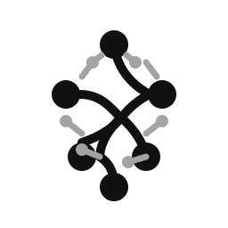

<p align="center">
  
</p>

<h1 align="center">MindLane</h1>

<p align="center">
  An AI-powered desktop mind-mapping app.<br/>
  Turn ideas, documents, and conversations into living mind maps.
</p>

<p align="center">
  
  
  
  
  
  <a href="https://fourwindff.github.io/MindLane/"></a>
</p>

---

## Features

### ✨ AI Generation & Chat

Describe what you're thinking in the floating chat panel and watch a mind map grow on the canvas. The assistant streams its progress live, and can keep refining the map — adding branches, restructuring nodes, and answering questions about what it built.

### 📄 Documents to Mindmap

Drop in what you already have and get a structured map back:

| Format             | Source                           |
| ------------------ | -------------------------------- |
| PDF                | research papers, reports, ebooks |
| DOCX / PPTX / XLSX | Office documents                 |
| Markdown           | notes and drafts                 |
| Web URL            | articles and pages               |
| Plain text         | anything on your clipboard       |

### 🎨 Canvas Editing

A fast, free-form canvas built on React Flow. Drag nodes anywhere, restyle them in the style panel, auto-layout when things get messy, and drive everything from the keyboard.

### 🔌 Multi-Provider

Bring your own API key — switch providers without changing how you work.

| Provider        | Models                                        | Extras                    |
| --------------- | --------------------------------------------- | ------------------------- |
| 通义千问 (百炼) | qwen-turbo / qwen-plus / qwen-max / qwen-long | vision + image generation |
| Kimi Code       | Kimi K2.5 / Kimi K2                           | —                         |
| MiniMax         | MiniMax M2.7 / M2.5 / M2.1 / M2               | image generation          |
| DeepSeek (V4)   | DeepSeek V4 Flash / V4 Pro                    | —                         |
| OpenCode Go     | GLM-5.x · Kimi K2.7 Code · Kimi K2.6 …        | —                         |

### 🧩 MCP Extensions

Extend what the assistant can reach through the **Model Context Protocol** — a built-in server catalog with brand icons, extensible via `settings.json`:

| Server                                               | Connection                                   | Auth                                                                      |
| ---------------------------------------------------- | -------------------------------------------- | ------------------------------------------------------------------------- |
|  **Notion**       | hosted remote server                         | one-click OAuth 2.0/PKCE                                                  |
|  **Obsidian** | local encrypted endpoint (`127.0.0.1:27124`) | API Key                                                                   |
|  **飞书**         | Lark MCP HTTP endpoint                       | App ID/Secret + UAT — one-click loopback OAuth with silent 30-day refresh |

---

## Getting Started

```bash
npm install
npm run dev      # start the app (Vite + Electron)
npm run build    # type-check, bundle, and package with electron-builder
```

Then open **Settings**, pick a provider, and paste in your API key.

---

<p align="center">
  <a href="https://github.com/FourWindff/MindLane">github.com/FourWindff/MindLane</a> ·
  <a href="https://fourwindff.github.io/MindLane/">fourwindff.github.io/MindLane</a>
</p>
